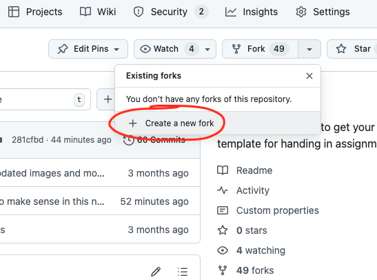
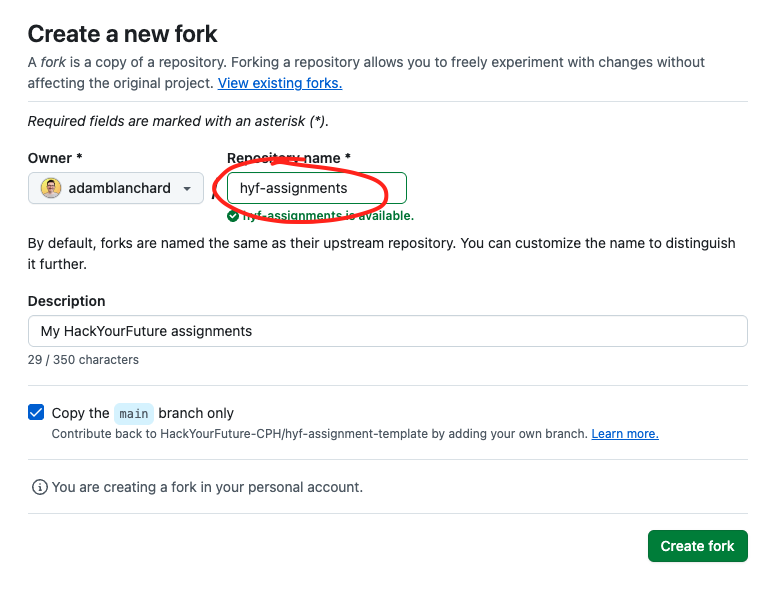
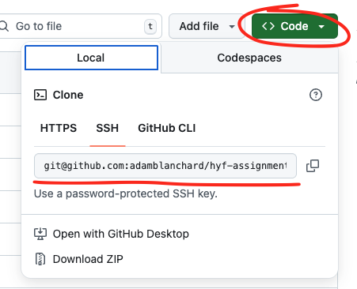
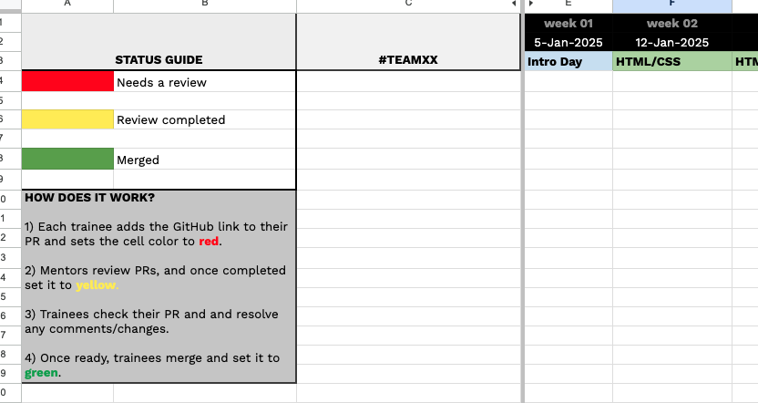

# HackYourFuture Assignment Template
> [!TIP]
> Need any help with git? Feel free to reach out on [#git-support](https://hackyourfuture-cph.slack.com/archives/CU1K85X3R)

## About this repo
This is a template repo that, as a trainee, you can fork to your own GitHub account, so you can submit your assignments.

## Trainee instructions
### Set up
If this is your first time using this repo, follow these steps:

1. Scroll to the top of this repo, and click "Fork" and "Create a new fork":

    

1. Follow the instructions to create a new repository under your own account, as shown below:

    
    
1. After the repo has been created, clone it locally as you would with any repo (see ["Cloning a respository"](https://docs.github.com/en/repositories/creating-and-managing-repositories/cloning-a-repository) for help):
  
    

### Updating with the latest changes
Sometimes we make changes to the assignments. If you have already forked this repo, you won't get these changes automatically. If you find that something is missing, or out of date, you can use the "Sync fork" feature on GitHub to pull in the latest changes to your own assignment repo.

### Completing the assignments
> [!TIP]
  > Before we get into the instructions, remember that GIT has a steep learning curve, and if you get stuck, refer back to your previous GIT sessions for a refresher or reach out for help on slack.
  >
  > Here's some general tips to keep in mind:
  > - Before creating a new assignment branch, always start from `main`.
  > - Keep your local `main` up to date with the remote `main`, especially after any merges.
  > - Write meaningful commit messages, to make it easier to follow your progress and review.

#### 1. Starting your assignment
1. Open your local assignment repo and check which branch you are on.
2. If you're on another assignment branch, make sure any unsaved changes are committed (or discarded), and then move to `main`.
3. If you're already on `main`, you're ready for the next step!
4. Create a new assignment branch with the following naming scheme `module-name-weeknumber/yourname`

Now you're ready to complete your assignment. Remember to commit often, with useful messages.

#### 2. Submission process
1. When you're ready to submit, make sure you're in your local repo and on the correct branch.
2. Push to your remote and create a PR on GitHub **by Wednesday end of day** (unless otherwise agreed). Make sure you are creating a PR against your own repo, and not the HackYourFuture-CPH one.
3. Find the "Assignment Submission" Google Sheet (bookmarked in your team's slack channel) and follow the instructions there. It will look something like this:
   
    

## Mentor instructions
### Reviewing assignments
If you're an Assignment Reviewer, follow these steps each week:
1. Find the "Assignment Submission" Google Sheet (bookmarked in the team's slack channel)
2. Look through the relevant week/module and choose a red PR to review
3. Once you've left your initial feedback, set it to yellow.
  > [!TIP]
  > You should default to use the "Request changes" option when reviewing a PR. It should be clear to the trainee when they need to change something. Once you are happy with the changes, then use "Approve".
  >
  > If you are not requesting any specific changes, it's ok to leave comments, but be sure to approve the PR as well so we don't leave anyone hanging.
4. Once any discussion/changes have been completed, it's up to the trainee to merge the PR and set it to green.
