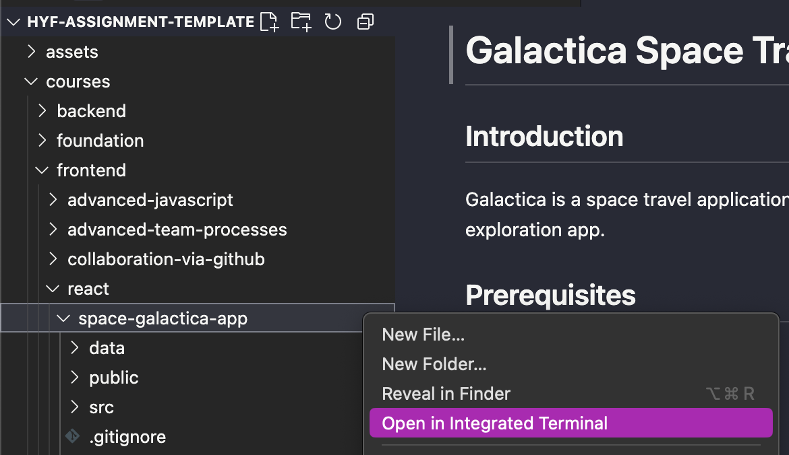
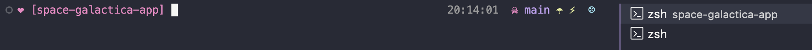

# Galactica Space Travel App

## Introduction
Galactica is a space travel application built with React. This project aims to teach trainees the fundamentals of React by creating a dynamic and interactive space exploration app.

## Prerequisites
- Node.js (version 20)
- npm or yarn

## Getting Started

### Installation
1. Navigate to this directory in a terminal   
`*` You can also open it in the VS Code terminal from the sidebar, if you already opened the whole directory or any of the parent directories. Right click on the `space-galactica-app` folder:

    <

    You should get something like this: 

    

 

2. Run `npm install` or `npm i` / `yarn install` or `yarn` to install the dependencies, depending on which package manager you chose to use - `npm` or `yarn`. 

### Running the Development Server

1. Run `npm run dev` (or `yarn run dev`)
2. Open your browser and navigate to http://localhost:5173 (or whatever the output of the above command suggets) to see the app in action.

## Assignments:

Throughout the weeks, you will be adding new features to this existing application.
For your tasks, search for the following in the code:

- Tasks for week 1: `Task - Week 1`
- Tasks for week 2: `Task - Week 2`
- Tasks for week 3: `Task - Week 3`

The comments you find will instruct you on how to complete the tasks each week.

### How to find the tags?

Use the global search function in your code editor or IDE. (`cmd + shift + F` OR `control + shift + F`)
